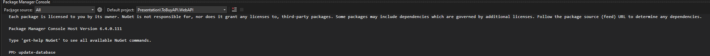
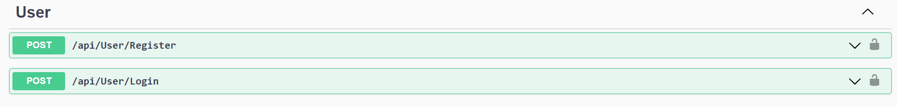
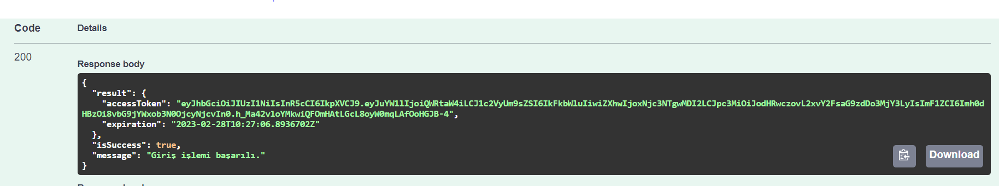
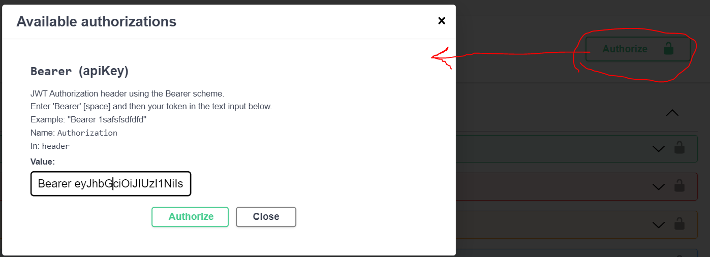

# ToBuyAPI Projesi
Bu repo [Univera](https://www.univera.com.tr/) firmasının [Patika](https://www.patika.dev/tr) üzerinden açmış olduğu hiring challange kapsamında oluşturulmuştur. İçerisinde bir adet Readme dosyası ve Asp.Net Web API projesi bulunmaktadır.

## Kurulum
```
git clone https://github.com/huseyinerdin/ToBuyAPI.git
```

## Kullanımı
Proje kurulumu yapıldıktan sonra Package Manager Console üzerinden update-database işlemi yapılarak database oluşturulmalıdır.
```
update-database
```


### Swagger Kullanımı
Proje kapsamında authentication ve authorization yapılanması bulunduğundan dolayı endpointler üzerinden istek atabilmek için login işlemi yapılmalıdır. Ardından giriş yapılan hesabın yetkileri dahilinde endpointler kullanılabilmektedir.



Login işlemi yapıldıktan sonra authorization işlemi yapılması için gelen response nesnesi içerisinden accessToken kopyalanarak swagger içerisinde oluşturulan authorization yapısına girilmelidir.




## License
[MIT](https://choosealicense.com/licenses/mit/)